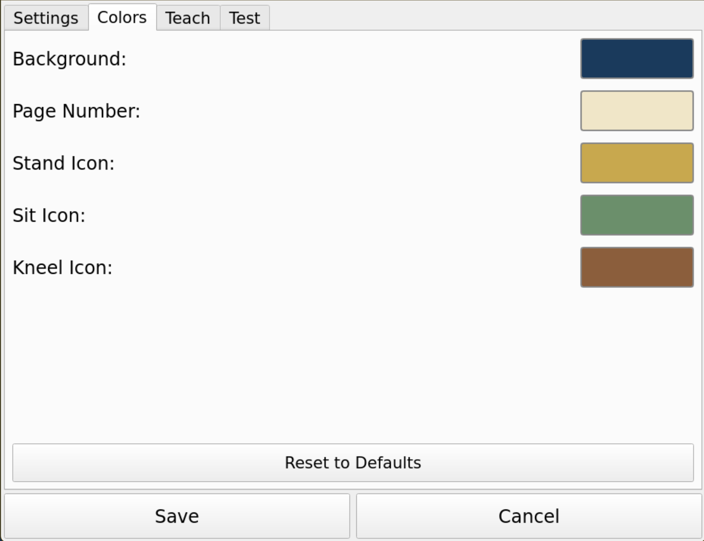

# Tsooyts Page Display — User Guide

The tsooyts page display system shows the current page number and congregation
posture cues on a screen so the entire congregation can follow along.  The
display is controlled by a TV remote held by an altar server.

## Contents

- [The Display Screen](#the-display-screen)
- [Remote Control Buttons](#remote-control-buttons)
- [Changing Pages](#changing-pages)
- [Posture Cues](#posture-cues)
- [Blank Screen](#blank-screen)
- [Settings](#settings)
- [Configuration Files](#configuration-files)
- [Stopping the App](#stopping-the-app)

---

## The Display Screen

In normal operation the screen shows:

- **Page number** — large digits on the left portion of the screen, readable from
  the back of the church.
- **Posture icon** — when active, a stick-figure icon appears on the right side of
  the screen.  The icon is positioned to suggest the posture: standing figure near
  the top, seated figure in the middle, kneeling figure near the bottom.  Each icon
  is drawn in a distinct color matching the posture (gold, green, or brown).
- **Settings button** — a small gear icon in the lower-right corner of the
  screen, accessible via the touchscreen or a USB mouse.  The posture icon
  never overlaps this button.

> 
> *Normal display: page number, no posture cue.*

---

## Remote Control Buttons

The following functions are supported.  The exact buttons on your specific remote
are configured during initial setup (see [Teach Mode](#teach-mode)).

| Function | Default remote button | Description |
|----------|----------------------|-------------|
| Next page | RIGHT arrow | Increment page number by 1 |
| Previous page | LEFT arrow | Decrement page number by 1 |
| Stand | UP arrow | Show standing posture icon |
| Sit | DOWN arrow | Show seated posture icon |
| Kneel | (configured) | Show kneeling posture icon |
| Blank screen | (configured) | Toggle blank screen (hides page and icon; gear remains) |
| Digit 0–9 | Number keys | Enter a page number directly |
| Accept | ENTER / OK | Confirm a dialed page number |
| Cancel | LAST / STOP / BACK | Cancel a dialed page number |
| Backspace | (configured) | Delete the last digit entered |

> **Tip:** Press the same posture button again to clear the posture icon and return
> to the plain page display.

---

## Changing Pages

### Step by step

Hold the RIGHT or LEFT arrow button to move to adjacent pages.  The display
updates immediately.  Holding the button down causes it to repeat after a short
delay (configurable in Settings).

### Dialing a page number directly

1. Press a digit on the remote.  A dark overlay appears over the page number
   showing the digit(s) entered so far.
2. Continue pressing digits (up to 4 digits total).
3. Press **ENTER** to jump to the entered page, or **CANCEL / BACK** to discard.
4. If you do nothing for 8 seconds the dial entry is automatically cancelled.
5. Press **BACKSPACE** to erase the last digit without cancelling.

> 
> *Dialing a page number before pressing ENTER.*

---

## Posture Cues

Press the appropriate button to display a posture icon on the right side of the
screen:

| Button | Icon | Color | Vertical position |
|--------|------|-------|-------------------|
| Stand | Standing stick figure | Gold / amber | Upper right |
| Sit | Seated stick figure | Green | Middle right |
| Kneel | Kneeling stick figure | Brown | Lower right |

The icons are white-on-transparent stick figures stored as `stand.png`,
`sit.png`, and `kneel.png` in the `src/tsooyts/icons/` directory.  The displayed color is
taken from the posture color settings and can be changed on the **Colors** tab
of the Settings dialog.

Press the same button a second time to clear the icon.

If the posture duration (on the **Settings** tab) is set to a non-zero value the
icon will automatically clear after that many seconds.

> 
> *Display showing standing icon, upper right.*

> 
> *Display showing seated icon, middle right.*

> 
> *Display showing kneeling icon, lower right.*

---

## Blank Screen

Press the button assigned to **Blank Screen** to hide the page number and posture
icon while keeping the background color and the gear settings button visible.
Press the same button again to restore the display.

This is useful between services or when the operator needs to suppress the display
without losing the current page number.

---

## Settings

Click the gear button in the lower-right corner of the screen to open the
settings dialog.  Use the touchscreen or a USB mouse.  The dialog is organized
into five tabs: **Settings**, **Colors**, **Teach**, **Test**, and **About**.

**Save** (at the bottom of the dialog) stores all changes across every tab and
closes the dialog.  **Cancel** discards all changes.

> 

### Settings tab

#### Repeat Delay

How long (in milliseconds) you must hold the Next/Previous page button before
it starts repeating.  Default: 500 ms.

#### Repeat Rate

How quickly (in milliseconds between repeats) the page number changes while
holding Next/Previous page.  Default: 200 ms (5 changes per second).

#### Posture Display Duration

How long (in seconds) a posture cue stays on screen before auto-clearing.
Set to **0** (the default) to keep the cue on screen until you press the
button again.

### Colors tab

> 

Five color swatches let you change the display color scheme:

| Swatch | Controls |
|--------|----------|
| Background | Screen background color (default: dark blue `#1a3a5c`) |
| Page Number | Page number text color (default: warm cream `#f0e6c8`) |
| Stand Icon | Color of the standing posture icon (default: gold `#c8a84e`) |
| Sit Icon | Color of the seated posture icon (default: green `#6b8f6b`) |
| Kneel Icon | Color of the kneeling posture icon (default: brown `#8b5e3c`) |

Click a swatch to open a color picker.  The swatch updates immediately to show
the chosen color.  Changes take effect when you click **Save**.

### Teach tab

The Teach tab lets you assign any button on your remote to any application
function.

> 

1. Switch to the **Teach** tab.
2. The tab shows two columns: *Controls* on the left and *Digits* on the right.
   Each row shows the function name, the currently assigned scancode (if any),
   and **Learn** / **✕** buttons.
3. Click **Learn** next to the function you want to assign.  The button turns blue
   and a status message says "Press remote button for: ...".
4. Point the remote at the IR receiver and press the button once.
5. The scancode is captured and shown in the row.  If the same button was already
   assigned to another function, that old assignment is automatically cleared.
6. Repeat for each function.
7. Click **Save** when done, or **Cancel** to discard changes.

> **Tip:** Use **Clear All Mappings** to erase all mappings and start fresh with
> a different remote.

### Test tab

The Test tab lets you verify your button assignments without changing any pages.

> 

1. Switch to the **Test** tab.
2. Press any button on the remote.
3. The tab shows:
   - The raw scancode received.
   - The function it is mapped to (green) or **UNMAPPED** (red) if the button
      has not been assigned.

### About tab

The About tab shows the application name (tsooyts / ցույց), version number,
author, and a QR code linking to the project's GitHub repository.

---

## Configuration Files

The app saves its state automatically to:

| File | Contents |
|------|----------|
| `~/.tsooyts/config.json` | Repeat timing, posture duration, colors |
| `~/.tsooyts/keymap.json` | Remote button → function mappings |

These files are created on first run.  You can back them up or copy them
to another unit to replicate settings.

---

## Stopping the App

During normal use the app runs full-screen without a window border or title bar.
The mouse cursor is hidden.

- **Touchscreen or mouse:** Click the gear button to open Settings.
- **Keyboard (SSH or attached keyboard):** Press **Escape** to quit.
- **Systemd service:** `sudo systemctl stop tsooyts`
