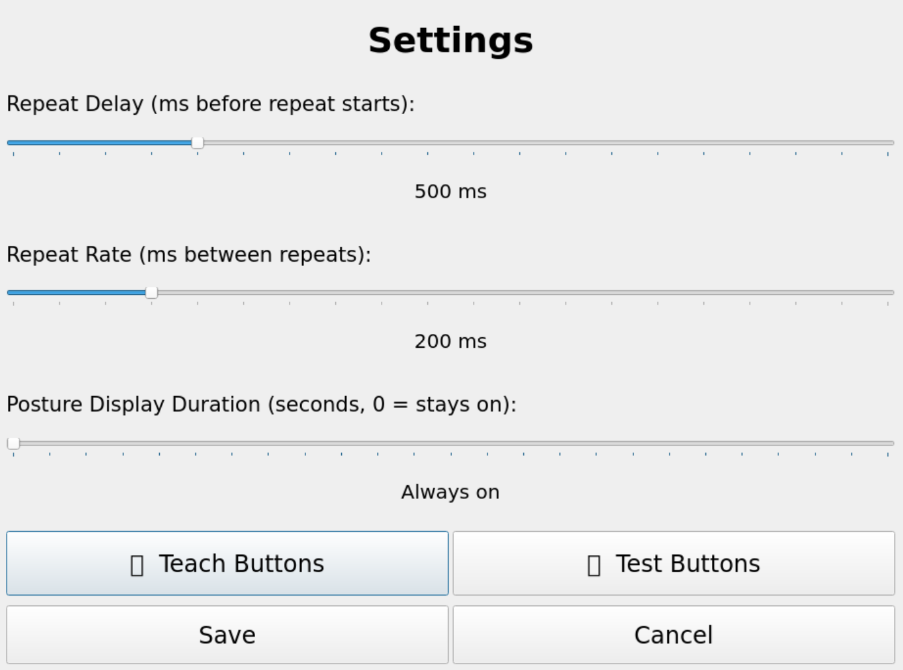
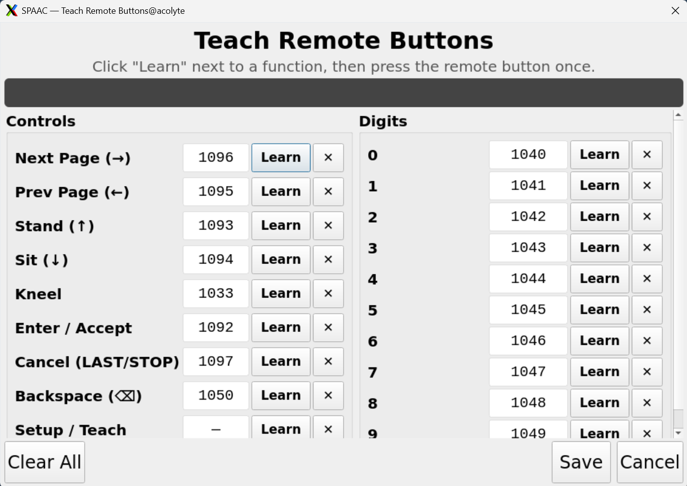
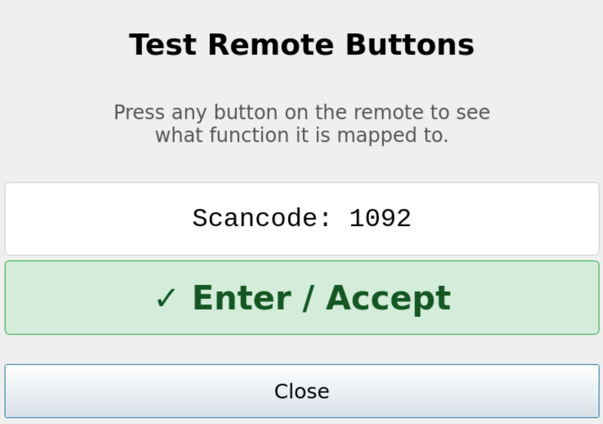

# SPAAC Page Display — User Guide

The SPAAC page display system shows the current hymnal page number and congregation
posture cues on a large screen so the entire congregation can follow along.  The
display is controlled by a TV remote held by a minister or acolyte.

---

## The Display Screen

In normal operation the screen shows:

- **Page number** — large digits centered on a dark blue background, readable from
  the back of the church.
- **Posture cue** — when active, a line of text appears above the page number
  (e.g., "PLEASE STAND") in a distinct color.
- **Settings button** — a small gear icon (⚙) in the lower-right corner of the
  screen, reachable by touch.

> 
> *Normal display: page 142, no posture cue.*

---

## Remote Control Buttons

The following functions are supported.  The exact buttons on your specific remote
are configured during initial setup (see [Teach Mode](#teach-mode)).

| Function | Default remote button | Description |
|----------|----------------------|-------------|
| Next page | RIGHT arrow | Increment page number by 1 |
| Previous page | LEFT arrow | Decrement page number by 1 |
| Stand | UP arrow | Show "PLEASE STAND" |
| Sit | DOWN arrow | Show "PLEASE BE SEATED" |
| Kneel | (configured) | Show "PLEASE KNEEL" |
| Digit 0–9 | Number keys | Enter a page number directly |
| Accept | ENTER / OK | Confirm a dialed page number |
| Cancel | LAST / STOP / BACK | Cancel a dialed page number |
| Backspace | (configured) | Delete the last digit entered |
| Settings | (configured) | Open the settings dialog |

> **Tip:** Press the same posture button again to clear the posture cue and return
> to the plain page display.

---

## Changing Pages

### Step by step

Hold the RIGHT or LEFT arrow button to move to adjacent pages.  The display
updates immediately.  Holding the button down causes it to repeat after a short
delay (configurable in Settings).

### Dialing a page number directly

1. Press a digit on the remote.  A dark overlay appears over the page number
   showing the digit(s) entered so far.
2. Continue pressing digits (up to 4 digits total).
3. Press **ENTER** to jump to the entered page, or **CANCEL / BACK** to discard.
4. If you do nothing for 8 seconds the dial entry is automatically cancelled.
5. Press **BACKSPACE** to erase the last digit without cancelling.

> 
> *Dialing "142" before pressing ENTER.*

---

## Posture Cues

Press the appropriate button to display a posture cue above the page number:

| Button | Text shown | Color |
|--------|-----------|-------|
| Stand | PLEASE STAND | Gold / amber |
| Sit | PLEASE BE SEATED | Green |
| Kneel | PLEASE KNEEL | Brown |

Press the same button a second time to clear the cue.

If the Settings > Posture duration is set to a non-zero value the cue will
automatically clear after that many seconds.

> 
> *Display showing "PLEASE STAND" above page 142.*

---

## Settings

Touch the **⚙** button in the lower-right corner (or press the remote button
mapped to "Setup") to open the settings dialog.

> 

### Repeat Delay

How long (in milliseconds) you must hold the Next/Previous page button before
it starts repeating.  Default: 500 ms.

### Repeat Rate

How quickly (in milliseconds between repeats) the page number changes while
holding Next/Previous page.  Default: 200 ms (5 changes per second).

### Posture Display Duration

How long (in seconds) a posture cue stays on screen before auto-clearing.
Set to **0** (the default) to keep the cue on screen until you press the
button again.

### Teach Buttons

Opens [Teach Mode](#teach-mode) to assign remote buttons to functions.

### Test Buttons

Opens [Test Mode](#test-mode) to verify your button assignments.

### Save / Cancel

**Save** stores the settings and closes the dialog.  **Cancel** discards changes.

---

## Teach Mode

Teach mode lets you assign any button on your remote to any application function.

> 
> Teach mode dialog with most buttons trained.

1. Open Settings, then tap **Teach Buttons**.
2. The dialog shows two columns: *Controls* on the left and *Digits* on the right.
   Each row shows the function name, the currently assigned scancode (if any),
   and **Learn** / **✕** buttons.
3. Tap **Learn** next to the function you want to assign.  The button turns blue
   and a status message says "Press remote button for: …".
4. Point the remote at the IR receiver and press the button once.
5. The scancode is captured and shown in the row.  If the same button was already
   assigned to another function, that old assignment is automatically cleared.
6. Repeat for each function.
7. Tap **Save** when done, or **Cancel** to discard changes.

> **Tip:** Use **Clear All** to erase all mappings and start fresh with a
> different remote.

---

## Test Mode

Test mode lets you verify your button assignments without changing any pages.

> 
> Test mode showing remote's *Enter/Accept* button pressed.

1. Open Settings, then tap **Test Buttons**.
2. Press any button on the remote.
3. The dialog shows:
   - The raw scancode received.
   - The function it is mapped to (green) or **UNMAPPED** (red) if the button
     has not been assigned.
4. Tap **Close** when finished.

---

## Configuration Files

The app saves its state automatically to:

| File | Contents |
|------|----------|
| `~/.spaac/config.json` | Repeat timing, posture duration, colors |
| `~/.spaac/keymap.json` | Remote button → function mappings |

These files are created on first run.  You can back them up or copy them
to another unit to replicate settings.

---

## Stopping the App

During normal use the app runs full-screen without a window border or title bar.
The mouse cursor is hidden.

- **Remote:** Press the button assigned to **Setup** to open Settings, then use
  the touchscreen to navigate.
- **Keyboard (SSH or attached keyboard):** Press **Escape** to quit.
- **Systemd service:** `sudo systemctl stop spaac`
